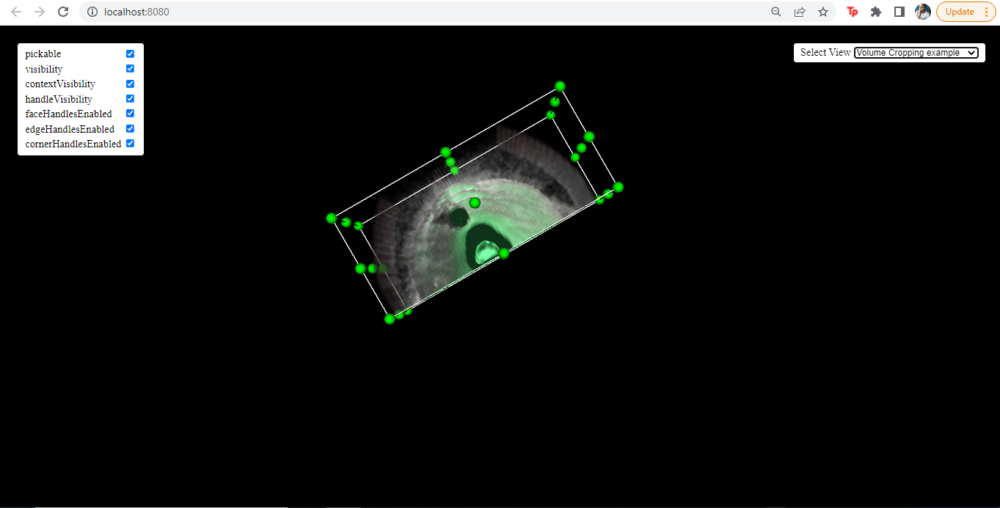

Team Members:
- Ahmed Mohamed Gamal
- Mohamed Adel
- Abdelrahman Salem
- Karim ELnady

Results:

- First Page
We show the head as the default starter, and able to change iso value using sider

- Second  Page
Using the combo box on the top right, the user is able to change to the chest, and able to using the cropping widget

Problem Faced:

- First problem we face was being able to understand the vtk code to be able to scroll between them
- Second problem was using the combo box and putting everything in one js file to be able to run with ease